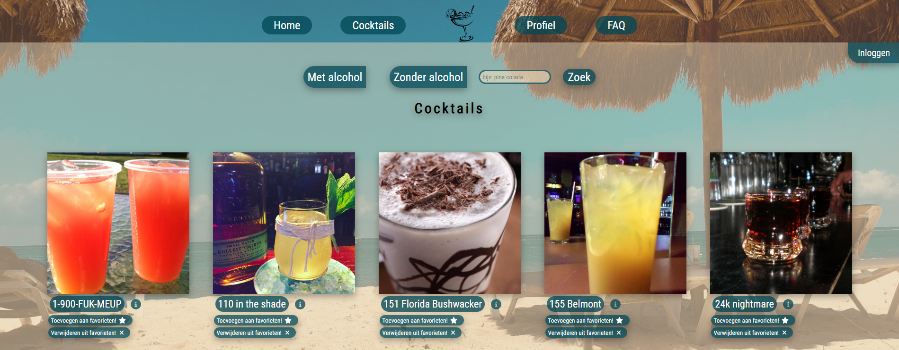

# Nemo Cocktail Finder.

Met de Nemo Cocktail Finder kan jij voor elke gelegenheid wel een lekkere cocktail vinden!

Variërend van echte zomerse cocktails, tot een winters mixje.
Zowel met als zonder alcohol. Met Nemo vind je het.

## Functionaliteiten.
Op de cocktail overzicht pagina van de app kan gezocht worden naar cocktails op naam of er kan gefilterd worden op alcoholisch en niet alcoholisch.

Op verschillende pagina's worden willekeurige cocktails getoond die men direct kan toevoegen aan favorieten. Ook kan er gekozen worden om een nieuwe willekeurige cocktail op te halen.

Er is een FAQ pagina om gebruikers snel op gang te helpen d.m.v meest voorkomende/waarschijnlijke vragen te tonen.

## De webapp starten.
nadat de github repo gecloned is, run je in de folder npm install.
alle vereiste packages worden geinstalleerd. packages die ik heb toegevoegd buiten de standaard packages zijn:
- "@fortawesome/fontawesome-svg-core"
- "@fortawesome/free-solid-svg-icons"
- "@fortawesome/react-fontawesome"
- "axios"
- "react-router-dom"

nadat de installatie is uitgevoerd kan deze gestart worden met npm start.

Verder zijn er voor de app geen bijzondere benodigdheden.
Er is geen speciale api key vereist.
De app is te gebruiker zonder account. Zonder account is er alleen geen toegang tot de profiel pagina en favorieten lijst.

de gebruiker dient enkel een account te maken via de registreer functie in de app.
nadat dat account is aangemaakt kan met het account worden ingelogd en worden de beveiligde pagina's bereikbaar.

